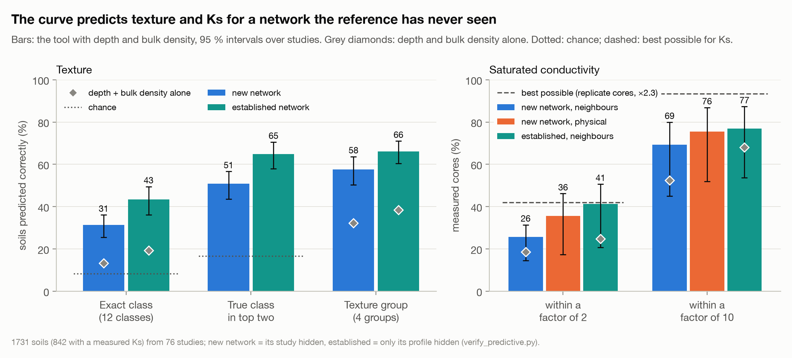
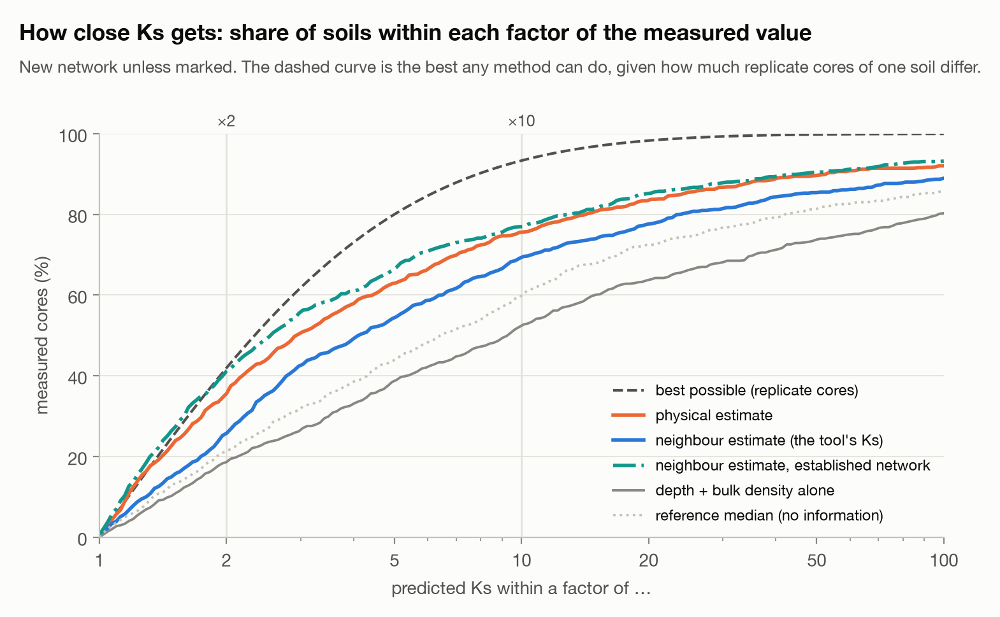
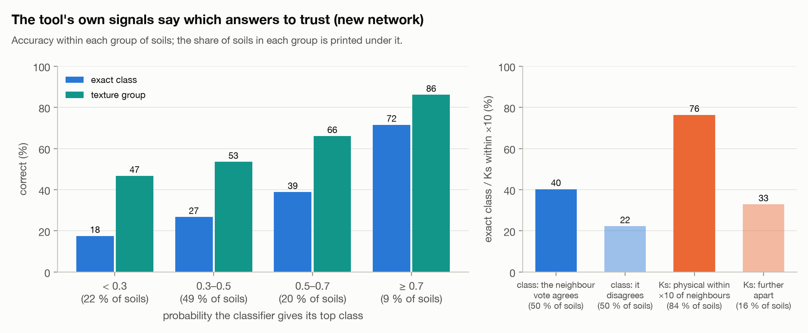
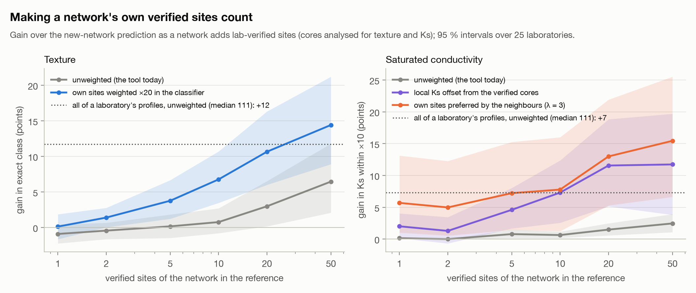

# py_HB_texture — soil texture and Ks from a measured water retention curve

Give it a measured soil water characteristic curve (SWCC) — from an in-situ
sensor or a laboratory core — and it returns the USDA texture class, the
sand/silt/clay fractions and the saturated hydraulic conductivity Ks, each
with an uncertainty range and the real reference soils it was matched to.

The tool fits a van Genuchten curve to the data and compares it with about
21,000 measured soil layers from nine databases. It is built for curves
measured on undisturbed soil — typically in-situ sensors — and the reference
can grow with your own lab-verified sites.

## What to expect

The tool always searches the whole reference. How well it does depends on
whether curves from your data source — your laboratory, or your sensor
network — are already in it, because curves from one source share a
measurement signature about as strong as the texture signal:

| | new data source | your source already in the reference | chance |
|---|---|---|---|
| exact USDA class (12 classes) | **31 %** (best possible* 46 %) | **39 %** (best possible 54 %) | 8 % |
| … with depth and bulk density | 31 % | 45 % | |
| texture group (4 groups) | **58 %** (68 %) | **62 %** (74 %) | 25 % |
| … with depth and bulk density | 58 % | 67 % | |
| Ks, typical error | factor of 4 | factor of 3 | — |
| … with bulk density | factor of 4 | factor of 2.6 | — |
| Ks within a factor of 10 | 68 % | 75 % | — |

\* The Cover & Hart (1967) bound for *any* method that uses the four van
Genuchten parameters (see "Validation"). All rows are the same 1,733 test
soils (`verify_holdout.py`); the "with" rows use the 1,683 of them that carry
depth and bulk density, compared with the curve alone on those soils.

A new depth at a site whose other horizons are already in the reference does
a little better than a new site (41.2 % against 38.9 %, p=0.014). Depth and
bulk density add about 6 points of exact class at both (p<0.001), and
nothing for a new source.

**You can move from the first column to the second.** Adding lab-verified
curves from your own sites (see "Adding your own verified data") is the most
effective improvement measured: with a source's own soils in the reference,
texture gains 5 points and Ks ranking goes from nearly useless (ρ = 0.11) to
modest (ρ = 0.36). With those in, supplying depth and bulk density together
adds about 4 points more. It takes quantity: among 21,000 reference soils a
handful of your own changes nothing, about 20 begin to help and 50 clearly
do (see "Is it predictive?").

A retention curve does not pin texture down: soils of neighbouring classes
produce nearly identical curves, and the laboratory that measured a curve
leaves a mark on it that is as large as the texture signal. The tool therefore
reports ranked class probabilities, fraction ranges and a Ks band rather than
a single answer, plus a second opinion whose agreement is a useful confidence
flag (right 35 % of the time when the two agree, 26 % when they do not, for a
new source). Treat Ks as an order-of-magnitude estimate.

## Is it predictive? What a new sensor network can expect

The question behind the tool: a network of in-situ sensors delivers retention
curves, and depth and bulk density are known from sampling at installation.
Can texture and Ks be inferred, and how accurately? The tests below simulate
it (`verify_predictive.py`, `verify_network.py`):

- **A new network** brings a measurement protocol the reference has never
  seen — every reference curve is a laboratory curve — so each test soil is
  predicted with its whole study or laboratory hidden. A "study" is one
  contributing entity, not a database: compilations are split into their
  studies wherever the metadata allow (ETH literature by reference, UNSODA by
  method, EU-HYDI contributors by data provider, AfSPDB by country and survey,
  KSSL by its two 33 kPa method eras), 125 units in all; WOSIS, HYBRAS and
  Russia carry no finer identifier and stay whole, which errs on the safe
  side (splitting the others changed exact class by +1.7 points).
- **An established network** has its own lab-verified sites in the reference
  in quantity: only the test soil's profile is hidden.

Every measure is compared, paired on the same soils, with what a user knows
without the curve — depth and bulk density alone (a gradient-boosted model on
those two) — and with chance; 95 % intervals come from a bootstrap over
studies, the study being the independent unit. 1,731 soils (842 with a
measured Ks) from 76 studies, all with depth and bulk density supplied:

| | new network | established network | depth + bulk density alone (new network) | chance / best possible |
|---|---|---|---|---|
| exact class (12) | **31 %** [26–36] | **43 %** [36–49] | 13 % | 8 % |
| true class in the top two | 51 % [44–57] | 65 % [58–71] | — | 17 % |
| texture group (4) | **58 %** [50–64] | **66 %** [60–71] | 32 % | 25 % |
| Ks within ×10, physical / neighbours | **76 %** [52–87] / 69 % [45–80] | 76 % / **77 %** [54–87] | 52 % | 93 %* |
| Ks within ×2, physical / neighbours | 36 % / 26 % | 36 % / 41 % | 19 % | 42 %* |
| Ks typical error, physical / neighbours | ×2.9 / ×4.1 | ×2.9 / ×2.5 | ×9.2 | ×2.3* |

\* Best possible for Ks: replicate cores of the same soil in the reference
(129 groups) differ by a median factor of 3.3, so a single measured core
sits about a factor of 2.3 from its soil's true value, and even a perfect
predictor would put only 42 % of cores within a factor of 2.

**The curve is what predicts.** For a new network it adds 18 points of exact
class (95 % interval +13 to +22) and 25 of texture group (+18 to +31) to what
depth and bulk density give, and 23 points of Ks within a factor of 10 for
the physical estimate (+5 to +33; +17, from +3 to +25, for the neighbours),
whose rank correlation with the measured Ks rises from −0.05 to 0.66. The
physical estimate is the better Ks for a new network (×2.9 against ×4.1);
once the network's own verified sites are in, the neighbour estimate reaches
×2.5, close to the replicate floor, and its 5–95 % band holds 89 % of the
measurements against a nominal 90 %.

**Accuracy varies by network.** Across the 20 studies with at least 20 test
soils, a new network's exact class runs from 10 to 42 % (10th to 90th
percentile, median 28 %), its texture group from 45 to 70 %, and Ks within a
factor of 10 from 43 to 91 %.

**The tool says which answers to trust.** For a new network, when the
classifier gives its top class at least 0.7 (9 % of soils) the class is right
72 % of the time and the group 86 %; below 0.3 (22 % of soils), 18 % and 47 %.
When the neighbour vote agrees with the classifier the class is right 40 % of
the time, 22 % when it does not; when the neighbour and physical Ks fall
within a factor of 10 of each other (84 % of soils), 76 % of them are within
a factor of 10 of the core, 33 % otherwise.

**Ground truth turns a new network into an established one — in quantity.**
Each installation's core, analysed for texture and Ks, can join the
reference (see "Adding your own verified data"). Added unweighted, a handful
changes nothing: 20 verified sites add 3 points of exact class and 50 add
6.5, while all of a laboratory's profiles (median 111) add 12 points and 7 of
Ks within ×10 (`verify_network.py` b; 25 laboratories, 40 fixed test
profiles each). Making the network's own sites count brings the gain in
much sooner — counted 20 times in the classifier, 10 verified sites add 6.8
points of exact class and 50 add 14.4; preferred by the neighbours, Ks within
×10 gains 5.7 points from the first core and 13 with 20 (`verify_network.py`
d). That weighting has been tested and not yet built into the tool.

**Caveats.** No in-situ curve is in the reference yet: the new-network
figures are what a new laboratory protocol gets, and in-situ curves differ
from laboratory ones (hysteresis, entrapped air, sensor calibration, often
a shorter dry range), so they are an expectation to verify with a network's
first cored installations, not a proof for sensors. The test soils are
balanced across the 12 classes, so a network's own class mix will move its
pooled figures. A few studies with unusual Ks (EU-HYDI Kätterer, 12 % within
a factor of 10) widen the Ks intervals. Reference soils close to the target
from other laboratories may help Ks (80 % within ×10 within 50 km against
59 % at 200–1,000 km) but the trend is not significant once the laboratory
is accounted for (`figures/predictive/p5_proximity.png`).

## Setup

    python3 -m venv .venv
    .venv/bin/pip install -r requirements.txt

Calling `.venv/bin/python` directly (as below) runs inside the virtual
environment without activating it.

The reference tables are committed, so **the tool runs out of the box with no
downloads.** Four tables are exceptions: EU-HYDI, which is restricted to its
consortium, the Laikipia soils, which are unpublished, and the Setenil and
Tomejil soils (Andalusia), whose distribution is not yet agreed. Their
tables (`data/euhydi_reference.csv`, `data/willard_reference.csv`,
`data/setenil_reference.csv`, `data/tomejil_reference.csv`) are built
locally with `prepare_euhydi.py`, `prepare_willard.py` and
`prepare_andalusia.py` by those who hold the data and are not distributed. A fresh clone runs on the other seven databases
(14,372 layers) and prints a note saying so.

## Usage

    .venv/bin/python swcc_texture.py mydata.csv

`mydata.csv` has two columns (comma or whitespace separated): suction h in
kPa and volumetric water content θ, as a fraction or in % (detected
automatically). At least five points; a curve that reaches both near
saturation and the dry end (≥ 1,000 kPa) carries the most information.

Options a user needs:

    --sample-type undisturbed   how the curve was measured (default). Use it
                                for in-situ sensors and intact cores.
    --sample-type disturbed     repacked or sieved samples
    --sample-type unknown       no information
    --depth 30                  sample mid-depth in cm (optional)
    --bulk-density 1.35         oven-dry bulk density in g/cm3 (optional)
    --andic yes                 the soil has andic properties (optional;
                                --andic no when known not to)
    --json out.json             also write the full result as JSON

Supplied together, depth and bulk density add about 4 points of exact class
when your own verified data are in the reference; for a data source the
reference has never seen their effect is small and not stable. Supply them
when you have them, knowing that part of the gain favours the classes your
own data contain most (see "Local covariates"). Bulk density also joins the
neighbour search, which lowers the Ks error slightly.

`--andic yes` is for soils known to have andic properties — an Andisol or
Andosol, or andic by oxalate Al + ½Fe and phosphate retention — typically on
volcanic ash. For such soils from a source the reference has never seen it
adds 9 to 14 points of exact class and 12 to 21 of texture group, and brings
the fractions 2 points closer; Ks does not change (see "Volcanic and andic
soils"). Leave it out when you do not know.

From Python: `swcc_texture.estimate(h, theta, sample_type="undisturbed")`;
for depth and bulk density, pass a classifier trained with them
(`TextureGBM(covariates=["depth_cm", "bd"])`) as `clf=`, a reference built
with `GshpReference(use_bd=True)` as `ref=`, and `depth=` and
`bulk_density=`. For andic properties, pass `TextureGBM(covariates=["andic_code"])`
and `andic="yes"` or `"no"`.
`--help` lists further options; they exist for the verification scripts, and
the defaults are the combination that tested best.

### Reading the output — three worked examples

**1. Silt loam — a real soil, read well** (`Testing/13_SiL_UNSODA.csv`).
The measured curve of a Humbeek silt loam (Belgium, Ap horizon, 0–30 cm,
intact core at the wet end; UNSODA code 4070), a soil that is not in the
default reference (it is in `data/unsoda_reference.csv`, which only
`--reference all` loads):

    $ .venv/bin/python swcc_texture.py Testing/13_SiL_UNSODA.csv

    van Genuchten fit (m = 1-1/n, alpha in kPa^-1):
      thetar = 0.0672  thetas = 0.3990  alpha = 0.0400  n = 1.649  m = 0.394  (RMSE 0.0074)

    Predicted USDA texture class: SILT LOAM   (from the gradient-boosted classifier)
      silt loam         55.9 %
      loam              13.7 %
      sandy loam        12.5 %
      sandy clay loam    6.0 %
      silt               3.7 %
      kNN second opinion agrees: silt loam (57.1 %)

    Particle fractions, mean [5-95 %]  (from the kNN; mean plots as: silt loam):
      sand   30.3 %  [  7.5 -  62.0]
      silt   52.0 %  [ 19.5 -  74.6]
      clay   17.7 %  [  9.0 -  33.0]

    Predicted Ks: 2.16 cm/h  [5-95 %: 0.00433 - 41.7]   (from the kNN: the 150 nearest undisturbed neighbors with a measured Ksat)
      physical second opinion agrees: 0.42 cm/h, 5.2x below  (0.458 raw; Marshall 1958 capillary bundle, pores capped at 50 cm suction, matched = raw / 1.09)

- **A clear answer.** The classifier puts more than half its probability on
  the true class, four times the next one, and the neighbour vote
  agrees — the combination to trust most, though not blindly: when the two
  agree the class is right about half the time (see "What to expect").
- **Fractions close to the laboratory's** (35 / 55 / 10 % sand / silt /
  clay): within 5 points for sand, 3 for silt and 8 for clay, all inside
  their ranges.
- **Ks within a factor of two** (2.16 against 1.21 cm/h measured), taken
  from undisturbed neighbours only because the wet end was measured on an
  intact core. The band is wide at the low end — a few neighbours are
  nearly impermeable — so read the median, not the band.
- **The physical estimate agrees**, from the other side: 0.42 cm/h, 2.9
  times below the measurement and 5.2 times below the kNN, which counts as
  agreement (within a factor of 10). It uses no neighbours, so the two
  errors are independent.

The next two curves are generated from the Carsel & Parrish (1988)
class-typical parameters: class averages rather than real samples, so they
are run with `--sample-type unknown` (real sensor data should keep the
default). They show what the tool does when the two opinions on the class
split, and when they agree on the wrong answer.

**2. Sandy clay loam — a disagreement that points to the right answer**
(`Testing/7_SCL_CnP.csv`):

    $ .venv/bin/python swcc_texture.py Testing/7_SCL_CnP.csv --sample-type unknown

    van Genuchten fit (m = 1-1/n, alpha in kPa^-1):
      thetar = 0.1000  thetas = 0.3900  alpha = 0.5900  n = 1.480  m = 0.324  (RMSE 0.0000)

    Predicted USDA texture class: SANDY LOAM   (from the gradient-boosted classifier)
      sandy loam        49.1 %
      loam              15.6 %
      sandy clay loam   15.4 %
      loamy sand         7.1 %
      sandy clay         5.3 %
      kNN second opinion DISAGREES: sandy clay loam (37.9 %)

    Particle fractions, mean [5-95 %]  (from the kNN; mean plots as: sandy clay loam):
      sand   66.2 %  [ 49.0 -  84.0]
      silt   10.6 %  [  5.3 -  25.9]
      clay   23.1 %  [  6.0 -  41.0]

    Predicted Ks: 4.71 cm/h  [5-95 %: 0.0278 - 21.2]   (from the kNN: the 150 nearest neighbors with a measured Ksat)
      physical second opinion agrees: 8.79 cm/h, 1.9x above  (9.58 raw; Marshall 1958 capillary bundle, pores capped at 50 cm suction, matched = raw / 1.09)

- **A preference for the wrong class.** The classifier gives sandy loam
  49.1 %; the true class, sandy clay loam, is third (15.4 %).
- **The second opinion disagrees, and it is right.** The neighbour vote names
  sandy clay loam with 37.9 %, and the fraction mean plots there too. When
  the two disagree, the classifier's answer is right only about one time in
  four for a new source: read a disagreement as "one of these two, check
  both".
- **Ks is inside its band but 3.6 times too high** (4.71 against 1.31 cm/h).
  The physics is higher still (6.7 times): this curve is a class average
  with an unusually large alpha, and capillary theory reads a large alpha as
  wide pores — the 50 cm cap limits that, it does not remove it. The two
  agree, and both are high, for different reasons.

**3. Loam — both opinions agree, and both are wrong**
(`Testing/4_L_CnP.csv`):

    $ .venv/bin/python swcc_texture.py Testing/4_L_CnP.csv --sample-type unknown

    Predicted USDA texture class: SANDY LOAM   (from the gradient-boosted classifier)
      sandy loam        34.0 %
      loam              30.3 %
      loamy sand        19.5 %
      sandy clay loam    6.4 %
      sand               5.5 %
      kNN second opinion agrees: sandy loam (44.9 %)

    Particle fractions, mean [5-95 %]  (from the kNN; mean plots as: sandy loam):
      sand   73.4 %  [ 14.6 -  89.7]
      silt   19.7 %  [  4.0 -  68.6]
      clay    7.0 %  [  1.5 -  16.8]

    Predicted Ks: 7.89 cm/h  [5-95 %: 0.026 - 30.2]   (from the kNN: the 150 nearest neighbors with a measured Ksat)
      physical second opinion agrees: 10.5 cm/h, 1.3x above  (11.4 raw; Marshall 1958 capillary bundle, pores capped at 50 cm suction, matched = raw / 1.09)

- **Agreement is not proof.** The classifier and the neighbour vote both
  say sandy loam; the true class is loam. When the two agree the answer is
  right about half the time with your source in the reference and a third of
  the time for a new one (see "What to expect"), and here the Carsel
  & Parrish loam sits where the reference holds sandy loams and loamy sands
  (the class-mean benchmarks below explain why), so both follow the
  reference to the same wrong place.
- **A flat answer is the warning.** The classifier's top class has only
  34.0 %, barely ahead of loam (30.3 %), with loamy sand close behind
  (19.5 %). Compare example 1, where the winner held more than half and four
  times the runner-up. When the top two are this close, read the answer as
  "one of these two" whatever the neighbours say.
- **The fractions come from the neighbours**, so they carry their error:
  the mean (73 / 20 / 7 % sand / silt / clay, against the class centroid's
  41 / 40 / 18) plots as sandy loam, and the silt range runs from 4 to 69 %.
- **Ks is 8 times too high** (7.89 against 1.04 cm/h measured, inside the
  band only because the band spans three orders of magnitude): a wrong
  texture neighbourhood gives a wrong Ks. The physics agrees with it and is
  also too high (10 times), for its own reason, so agreement raises
  confidence but does not certify an answer.

## Adding your own verified data

When some of your sites are sent to the laboratory for texture (and, ideally,
Ks measured on undisturbed cores), feed them back into the reference. Later
predictions from the same sensors or laboratory are then matched against your
own soils — the "already in the reference" column above.

Prepare one CSV with one row per retention point. Every row needs only
`sample_id`, `h_kpa` and `theta`; the per-sample values (texture, Ks, depth,
coordinates, ...) need to be written once, on any row of the sample, and the
other rows can stop after `theta` or leave those fields empty. Repeating them
on every row also works; if they differ, the first non-empty value is used.

    sample_id,h_kpa,theta,sand,silt,clay,ksat_cmh,depth_cm,bd,sample_type,site,lat,lon
    S01-30,0,0.43,60,13,27,1.3,30,1.40,undisturbed,S01,29.64,-82.35
    S01-30,5,0.36
    S01-30,33,0.21
    ...
    S02-30,0,0.47,20,55,25,,30,1.30,undisturbed,S02,29.71,-82.40
    S02-30,5,0.44
    ...

`sample_id`, `h_kpa`, `theta`, `sand`, `silt` and `clay` are required;
`ksat_cmh` (cm/h), `depth_cm`, `bd` (g/cm3), `sample_type` (default
undisturbed), `site` (groups the samples of one location) and `lat`/`lon` (decimal
degrees, WGS84; south and west negative) are optional. Then:

    .venv/bin/python add_local_data.py mycurves.csv --source mynetwork

Each sample is fitted with the tool's own routine (at least five points, fit
RMSE ≤ 0.03) and written to `data/local_reference.csv`, which the default
reference picks up automatically; adding a `sample_id` again replaces it. The
file is git-ignored, so your data stays private. The more of your texture
range the verified sites cover, the better — a few sites per soil type are
worth more than many of one. Expect a measurable gain from about 20 verified
sites and a clear one from 50 (see "Is it predictive?"): with the default
reference, a handful is outvoted by the 21,000 soils around it.

## How it works

1. **Fit.** Van Genuchten parameters (θr, θs, α, n) are fitted by least squares
   with the Mualem constraint m = 1 − 1/n. The fit's covariance is sampled
   300 times, so fit uncertainty flows into every output.
2. **Texture class — gradient-boosted classifier.** Each fitted curve is read
   off at eight fixed suctions — 0, 50, 100, 330, 1,000, 5,000, 15,000 and
   100,000 cm — and the classifier is trained on the reference layers' water
   contents there, plus sample type (and depth and bulk density when you
   supply them), class-balanced; its probabilities are averaged over the 300
   draws. A soil stated to be andic (`--andic yes`) is matched on the four
   van Genuchten parameters instead, which carry the andic flag much better
   (see *Volcanic and andic soils* below).
3. **Everything else — nearest neighbours.** For each draw the 30 nearest
   reference layers in the same standardised space (plus bulk density, when
   you supply it) vote, weighted by 1/d² and
   by inverse class frequency. They supply the particle fractions and their
   ranges, the list of matched soils, and the second-opinion class. **Ks** comes
   from a search of its own: the 150 nearest layers that carry a measured Ks
   (`KS_K`, chosen out of fold; see *Ks* below); for an undisturbed sample,
   only from *undisturbed* neighbours, because near saturation an intact core
   keeps the large pores that repacking destroys. Disturbed and unknown
   samples use all soils, since the reference holds only 45 disturbed layers
   with a measured Ks. A **second opinion on Ks** comes from capillary theory
   applied to the fitted curve alone, with no neighbours behind it; for a
   source the reference does not hold it is the more accurate of the two
   (see "Ks").

The classifier and the neighbours see the same draws. Only the class comes
from the classifier; `--model knn` swaps it for the neighbour vote and leaves
every other number identical.

## Reference data

| source | layers | with Ks | sample type | distribution |
|---|---|---|---|---|
| GSHP (Gupta et al. 2022), quality-filtered | 9,996 | 6,644 | per contributor | CC BY 4.0, committed |
| NCSS/KSSL (USDA-NRCS) | 2,530 | 0 | undisturbed | public domain, committed |
| Hohenbrink et al. (2023), German cores | 560 | 402 | undisturbed | committed |
| Zanjanrood, north-west Iran (Babaeian et al. 2015) | 169 | 169 | undisturbed | committed |
| Arizona, USA (E. Babaeian, measurements shared with this project) | 21 | 21 | undisturbed | committed |
| Canary Islands andic soils (Armas Espinel 2013) | 66 | 62 | undisturbed | committed |
| Yellow River Basin, China (Tong et al. 2024) | 1,030 | 1,015 | undisturbed | committed |
| EU-HYDI (Weynants et al. 2013), 21 laboratories, 16 countries | 6,797 | 2,704 | per sample | **restricted, never distributed** |
| Laikipia, central Kenya (Willard et al., under review) | 86 | 0 | undisturbed | **unpublished, never distributed** |
| Setenil, Andalusia, Spain (K. Vanderlinden, IFAPA) | 44 | 44 | undisturbed | **not distributed (pending agreement)** |
| Tomejil vertisol, Andalusia, Spain (Vanderlinden et al. 2021) | 54 | 0 | undisturbed | **not distributed (pending agreement)** |
| **default reference** | **21,353** | **11,061** | | |

Each source gets its own `prepare_*.py`, because each ships something
different, and each needed a correction before its curves were comparable:

- **KSSL** has no reading wetter than 6 kPa, so nothing constrains saturation;
  a plain fit puts α five to sixteen times too low. One anchor point at
  θ(0) = 0.95 × porosity fixes it (θs sits ~5 % below porosity because of
  entrapped air; median θs/porosity in GSHP is 0.946). KSSL has no Ks.
- **Hohenbrink** has ~199 HYPROP points on the wet limb against three WP4
  points on the dry one; points are thinned to one median per pF bin so the
  fit is not weighted 98:2 away from the part of the curve that carries
  texture.
- **EU-HYDI** samples need at least five reliable retention points and USDA
  fractions; Ks is taken only from saturated-conductivity methods, and curves
  are thinned in pF as for Hohenbrink. Several contributors reported only two
  or four points per sample (Greece, most of Spain), too few to fit a curve.
  Polish fractions are summed from raw size classes breaking at 2 and 50 µm.
- **Zanjanrood** curves combine an intact core for 0–100 cm suction with
  sieved soil for the dry end, and are refitted here; four curves with no
  point wetter than 330 cm are dropped. Ks was measured on repacked samples
  but is used as undisturbed: predicted from the rest of the reference before
  the merge, it came out at the right level (`verify_external.py`).
- **Laikipia** clays (74 of 86 samples) on the northern slopes of Mount Kenya
  were measured on a sandbox to 10 kPa and pressure plates beyond. The
  released data raise the sandbox points by one constant per sample, to 95 %
  of porosity at saturation, which leaves a step between 10 and 14 kPa
  holding half of each curve's water loss. The laboratory's original sandbox
  values run continuously into the pressure plates, but the whole curve reads
  far too dry for a clay. `prepare_willard.py` takes the original sandbox
  values and the released pressure-plate values (which carry the laboratory's
  corrections of eight out-of-sequence readings) and scales each whole curve
  by one factor, so that saturation sits at 95 % of porosity (median ×1.53).
  The factor is set by the wet end alone, yet it puts the wilting point at
  28.3 % water against 28.4 % for the reference clays; flat or tapered
  corrections of the sandbox alone leave the curves too dry to read as clay.
  A constant factor fits a volumetric-basis error better than shrinkage,
  which is a question put to the laboratory. Ks was measured only in
  the field, in the dry season, when these vertic clays were cracked (median
  178 cm/h on the drier clay-rich samples), so none of it enters the
  reference; the field values stay in the table.
- **Arizona** curves run from saturation to about 29,000 kPa; only points to
  1500 kPa are fitted, as for the rest of the reference, and a 500 cm reading
  that falls below the 800 cm one in three samples (AZ15, AZ18, AZ19) is
  replaced by interpolation between its neighbours. There are no coordinates
  or depths, so the soils are not on the map.
- **Canary Islands** retention points are not tabulated in the thesis; they
  are read from its vector figures (Tempe cells to 90 kPa, pressure plates at
  100, 500 and 1500 kPa) and check against its tables (water at 1500 kPa
  within 0.3 points) and its own van Genuchten fits. Texture is the
  hydrometer analysis after hexametaphosphate dispersion, which under-disperses
  andic material; the resin-dispersed fractions are kept alongside.
- **Yellow River Basin** curves (centrifuge, 1–1000 kPa, 475 sites to 5 m
  deep) are published only as the authors' van Genuchten fits, and in 170 of
  them the fitted θs is more than 0.05 from the measured one. Each is rebuilt
  at ten suctions from its fit, the measured θs is added at h = 0, and the
  whole is refitted here. Texture is by laser diffraction, which reads about
  half the clay of the pipette and hydrometer methods elsewhere in the
  reference (median 10 % against 18 % for silt loam). As a new source the set
  reads poorly (13 % exact class, `verify_external.py`): with its large α the
  curves look coarser than they are. Added to the reference it does no harm
  to the other soils (+1.3 pp exact, p=0.15) and helps silt loam (+6 pp,
  p=0.08).
- **Setenil** (olive groves in the Setenil de las Bodegas catchment, Cádiz;
  sandy loams and sandy clay loams) has 44 intact rings: 11 locations, under
  the tree canopy and in the inter-row, at 5 and 15 cm. Water content is
  gravimetric (suction tables to 500 cm, WP4 dew-point readings beyond) and
  is made volumetric with the bulk density of each 100 cm³ ring; a second
  density column in the workbook, 1.087 times larger for every ring (most
  likely from a comparison with 250 cm³ rings), would put saturation at 1.25
  times the porosity. Texture is the regional laboratory's analysis, most
  likely by hydrometer with USDA limits and carbonates removed. As for
  Arizona, only points to 1500 kPa are fitted; only 6 rings have a WP4
  reading below that (the WP4 readings were selected by eye). Ks was
  measured on the same rings with a laboratory permeameter (median 4.2
  cm/h).

**Sample type** (`sample_type`, with its evidence in `sample_type_source`) is
set by how the wet end of each curve was measured: an intact core for the wet
end with sieved material for the dry end — standard practice — counts as
undisturbed; disturbed means the wet end itself was measured on repacked soil.
Labels come from each source's metadata: GSHP's own field, EU-HYDI's method
table per sample, the KSSL method codes and the Hohenbrink data description.
Florida's soils (5,735 layers), which GSHP lists as unknown, are undisturbed:
one of the dataset's authors recalls the rings for conductivity and water
release being taken in the field for each horizon, without repacking. In the
default reference: 18,551 undisturbed, 1,581 disturbed, 1,221 unknown. Of
the 11,061 layers with a measured Ks, 10,995 are undisturbed and only 45
disturbed.

**Coverage.** 20,696 layers carry coordinates (`figures/fig2_coverage_map.png`).
North America holds 9,256, Europe 7,838 (38 %), Asia 2,653 (1,030 of them in
the Yellow River Basin), South America 639, Africa 750 (with the Canary
Islands) and Australasia 111; Florida alone supplies 28 %. Southern Europe and the Balkans remain thin.

**Texture classes.** The classes are far from balanced
(`figures/fig5_texture_classes.png`): sand outnumbers silt 56 to 1, and
Florida alone supplies 79 % of the sand (3,657 of 4,620 layers). The
restricted tables supply most of the silty clay (57 %) and 40 % of the silt
loam; the Yellow River Basin adds 732 silt loams and 22 of the 83 silts.
Ks is measured for 80 % of sandy soils but for about a third of silty ones.

| group | class | layers | share | with Ks | distributed | restricted |
|---|---|---|---|---|---|---|
| Sandy | sand | 4,620 | 21.6 % | 4,020 | 4,051 | 569 |
| | loamy sand | 1,467 | 6.9 % | 856 | 1,000 | 467 |
| Loamy | sandy loam | 3,817 | 17.9 % | 1,755 | 2,306 | 1,511 |
| | loam | 1,882 | 8.8 % | 516 | 1,162 | 720 |
| | sandy clay loam | 1,338 | 6.3 % | 794 | 1,101 | 237 |
| | clay loam | 1,007 | 4.7 % | 370 | 632 | 375 |
| Silty | silt | 83 | 0.4 % | 48 | 69 | 14 |
| | silt loam | 3,328 | 15.6 % | 1,331 | 1,989 | 1,339 |
| | silty clay loam | 1,326 | 6.2 % | 327 | 721 | 605 |
| Clayey | sandy clay | 185 | 0.9 % | 112 | 172 | 13 |
| | silty clay | 627 | 2.9 % | 182 | 270 | 357 |
| | clay | 1,673 | 7.8 % | 750 | 899 | 774 |

| texture group | layers | share | with Ks | distributed | restricted |
|---|---|---|---|---|---|
| Sandy | 6,087 | 28.5 % | 4,876 (80 %) | 5,051 | 1,036 |
| Loamy | 8,044 | 37.7 % | 3,435 (43 %) | 5,201 | 2,843 |
| Silty | 4,737 | 22.2 % | 1,706 (36 %) | 2,779 | 1,958 |
| Clayey | 2,485 | 11.6 % | 1,044 (42 %) | 1,341 | 1,144 |
| **total** | **21,353** | | **11,061** | **14,372** | **6,981** |

The neighbour vote weights each class by the inverse of its count and the
classifier uses balanced class weights, so neither favours sand for being
common. Weighting cannot add information, though: silt (83 layers) and sandy
clay (185) remain the least-represented classes, and the per-class accuracy
in "Validation" reflects it.

UNSODA 2.0 (581 soils) and the Belgian sDB (165) are also prepared and can be
loaded with `--reference all`, but most of their soils are already inside
GSHP, so they are not in the default.

The CSIRO Boorowa Farm soils (57 intact and repacked samples from seven NSW
sites, 2025; `prepare_boorowa.py`) are kept as an independent Australian test
set rather than joined: their CC BY-NC-SA licence keeps them local, and they
are too few to change the class balance. As a new source they read 46 %
exact class and 70 % texture group, with a macro-F1 of 42 against 16 for
always answering their majority class, sandy loam (which is right for 68 %
of them); the seven clays and sandy clays are read correctly four times
(`verify_external.py boorowa`; per-soil report with
`figures/make_external_report.py boorowa`).

The **New Jersey Coastal Plain soils** of Soil Survey Investigations Report
26 (USDA-SCS and Rutgers, 1974; `prepare_nj_ssir26.py`) are a second
independent test set, and the only one with a Ks measured on intact cores
for every soil: 236 horizons from 46 pedons sampled in 1956–61, the same
soils on which Arya et al. (1982) tested the Arya–Paris model. Rutgers
measured saturation, 0.02–1 bar and Ks on 3-inch cores and 2–15 bar on
crushed samples; texture is the SCS pipette analysis. The sheets were
transcribed from the scan and checked against the NASA report's
independent copy of 181 of the curves (97.8 % of 1,439 points agree within
0.011) and against the NCSS database's clay (225 layers, all within 0.8
points). The soils are mostly coarse: 109 sandy loams, 50 sands and 32
loamy sands. As a new source they read 56.4 % exact class (46.2 % for always
answering sandy loam), 78.8 % texture group and macro-F1 46 against 9, with
clay over-predicted (17 % against 11 %). Here the fixed heads beat the vG
parameters by 14 points of exact class. Ks is within ×1.8 for the kNN
(ρ = 0.76, 95 % within 10×) and ×2.2 for the capillary bundle (ρ = 0.80,
91 %); uncapped, the bundle would be ×17 (`verify_external.py nj_ssir26`;
`figures/make_external_report.py nj_ssir26`).

The **Andalusian soils** measured by K. Vanderlinden (IFAPA;
`prepare_andalusia.py`, one table per site) were tested with
`verify_external.py` before any joined.

- **Setenil** (44 rings, 29 sandy loams and 15 sandy clay loams) joined the
  default in 2026-10. As a new source it reads 31.8 % exact class (38.6 %
  with depth and bulk density) against 65.9 % for always answering sandy
  loam, 54.5 % texture group and macro-F1 41 against 40; fractions are
  within 9.8 (sand), 6.8 (silt) and 5.8 (clay) points. The misses follow
  soil structure, not texture: under the tree canopy only 14 % of rings are
  read correctly and 59 % read as loamy sand (loose soil, bulk density
  1.37–1.48, median Ks 5–23 cm/h), while the compacted inter-row rings
  (bulk density 1.65, Ks 0.7–0.8 cm/h) are right 50 % of the time. With its own sites held out of an expanded
  reference, the set gains (47.7 % exact with depth and bulk density; Ks
  ranking ρ 0.40 → 0.65, 93 % within a factor of 10), and adding it leaves
  the rest of the reference unchanged (−0.1 pp exact for a new site, −0.5 pp
  for a new source, both n.s.; Ks for a new source 0.954 → 0.940 dex,
  p=0.04; both measured with the 30-neighbour Ks lookup in use before
  2026-10). Ks as a new source: the kNN is within ×3.2 (ρ = 0.64), the
  capillary bundle ×3.5 (ρ = 0.74).
- **Tomejil** (54 rings, 0–5 cm, a Chromic Haploxerert under direct drill
  and conventional tillage near Carmona; Vanderlinden et al. 2017, 2021)
  joined the default in 2026-10. Its curves are gravimetric: the soil is rich
  in smectite and its bulk density runs from about 1.0 wet to 1.6 dry, which
  is why its authors work in gravimetric water, and no ring has its own
  density. Water is made volumetric with a density that follows the water
  content by normal shrinkage (specific volume 1/2.65 + w, capped at 1.6
  g/cm³), a model rather than a measured shrinkage curve. Texture is known
  per treatment only (G. Martínez's thesis, 0–20 cm: sand 8.0–8.3 %, clay
  55.2–56.0 %, so clay), and there is no Ks. As a new source every ring reads
  as clay, with 54 % clay predicted against 56 % measured (sand within 9.6
  points). With one density per treatment instead (Ordóñez Fernández et al.
  2007), 87–89 % of rings read as clay with only 40 % clay predicted: the
  single density understates the water held at the dry end, where the soil
  is densest (0.21 against 0.30 at 1500 kPa). Fitted to its whole WP4 dry end
  every ring reads silty clay loam, so points stop at 1500 kPa. Adding the set
  is neutral for the rest of the reference (+0.9 pp exact for a new site,
  −0.5 pp for a new source, both n.s.). Its 54 rings come from one field and
  share two sets of fractions, so vertisol-like curves may find most of their
  neighbours in it and get narrower fraction ranges than the measurements
  justify. The same conversion helps the **Laikipia** clays, also vertic:
  as a new source 97 % of them read as clay (81 % with one density per
  sample) and their mean predicted clay is 51 % against 52 % measured (43 %
  with one density). Converted with one density, both vertisols seem to lose
  water steeply just below saturation (at 330 cm they hold 64–65 % of their
  water at saturation, against 82 % for the reference clays); with the
  shrinking density they hold 80–81 %, like the other clays.
- **Doñana** (El Abalario and El Acebuche, aeolian sands under scrub; 17
  curves at 11 and 6 depths to over 2 m, each the mean of 2–3 rings, sand
  boxes to 50 kPa, bulk density 1.70) is a test set: it has no
  particle-size analysis, only "practically all sand". Read as a new source,
  12 of the 17 curves are sand and 5 loamy sand (texture group 100 %). Its
  Ks was measured in the field with a Philip–Dunne infiltrometer at 5–10 cm,
  at points other than the retention samples, so it can only be compared
  site by site: at El Acebuche the surface curve gives 20 cm/h (kNN) and 19
  (capillary bundle) against a field median of 27 (20–38); at El Abalario
  the 20 cm curve gives 19 and 19 against 70 (36–271), above the kNN's
  5–95 % band.

**Volcanic parent material and andic properties** (`volcanic`, `andic`,
joined from `data/volcanic_flags.csv` by `prepare_volcanic.py`) are two
separate fields, because they differ: the Laikipia soils sit on Mount
Kenya's volcanics but show no andic properties. Evidence is taken from the
sources first — KSSL taxonomy and andic lab criteria, the Africa Soil
Profiles database's parent material and class, the EU-HYDI report's own
description of each contributor's sites — then from the SoilGrids 2.0
Andosols probability and the distance to Smithsonian GVP volcanoes, which
are specific but insensitive (checked against the KSSL labels). In the
default reference: 524 layers are known volcanic and 42 probable; 252 are
andic and 155 likely andic (Campania, the Canary Islands; Kamchatka, from
bulk density ≤ 0.90).

## Validation

Accuracy is measured for both kinds of user by hiding known soils and
predicting them. For a **new source**, each target's whole contributing
laboratory is removed from the reference during the test; for a source
**already in the reference**, the target's own profile, or only the target
layer itself. In real use nothing is removed — this is only how the
situations are simulated.
Matching a soil against other soils from its own laboratory is worth about 10
points of exact class. All figures come from paired tests on the same
targets, with the classifier and the neighbours both blind to the target.

### Texture

The same 1,733 targets (150 per class, every silt) under each hold-out, with
the shipped tool (`verify_holdout.py`, `figures/validation/v6_holdout_levels.png`).
The last two columns run it as with `--depth` and `--bulk-density`, on the
1,683 targets that carry both:

| hidden along with the test soil | real-life situation | exact class | texture group | exact, + depth & BD | group, + depth & BD |
|---|---|---|---|---|---|
| nothing else | a new depth at a site already in the reference | 41.2 % | 63.8 % | 46.6 % (+5.9, p<0.001) | 68.6 % (+4.8, p<0.001) |
| its profile | a new site, from a source already in the reference | 38.9 % | 62.4 % | 44.5 % (+5.9, p<0.001) | 67.2 % (+4.6, p<0.001) |
| its whole source | a new site, from a new source | **30.5 %** | **57.6 %** | 31.1 % (+1.1, p=0.25) | 57.9 % (+0.4, p=0.70) |
| best possible (ceiling) | | 54 % / 46 % | 74 % / 68 % | | |

(The gains in brackets are paired against the curve alone on the same 1,683
soils, where it scores 40.8, 38.6 and 29.9 % exact.)

**Fixed heads against the van Genuchten parameters.** Until September 2026
the tool matched on the four fitted vG parameters. On the same targets those
score 41.3, 38.1 and 30.5 % exact (63.9, 62.7 and 58.2 % group), and 45.0,
42.1 and 31.1 % with depth and bulk density (`SWCC_FEATURE_MODE=vg`). On the
current reference the fixed heads are level on the curve alone (−0.1 to
+0.8 points; they led by 1.6 to 2.8 points when adopted) and ahead with the
covariates (+1.6 and +2.4 points with the source in the reference). They
also lower the Ks error for a new source (0.62 against 0.74 dex), lifted the
rarest class, silt, from 15 to 30 % found when they were adopted
(`verify_hybrid.py`), and predict better on four of the six outside sets
(see *Reference data*). What they lose is the andic
flag, so a soil stated andic is still matched on the vG parameters (see
*Volcanic and andic soils*).

76 of the targets are Yellow River Basin soils, including 22 of the 83 silts,
and they read poorly (see "Reference data"). On the vG parameters and the
previous target draw, without them, the reference scored 40.9, 38.5 and 31.9 % exact —
within a point of the reference before the Yellow River soils joined (41.4,
39.7 and 30.9 %) — so the lower figures above reflect harder targets, not a
worse reference. Part of the depth-and-bulk-density gain with the source in
the reference is the Yellow River soils' own signature (deep loess cores); on
the previous draw it is +3.1 pp for a new site (p=0.003).

Keeping the target's other horizons in the reference helps a little
(+2.3 pp, p=0.014). 1,140 of the targets have a horizon of the same class in
their profile (45.1 % with it in the reference against 42.7 % without);
siblings of a different class barely matter (32.5 % against 31.0 %) —
eluviation makes the horizons of one profile genuinely different samples.
What matters is the data source: hiding it costs 8.4 points (p<0.0001).

**The ceiling.** Cover & Hart (1967) bound the Bayes error by the
nearest-neighbour error, giving a model-free limit for any classifier on the
fitted curve (`verify_ceiling.py`, computed on the four vG parameters): 1NN
accuracy 31.1 % gives a bracket of [31.1 %, 54.0 %] in-distribution and
[23.5 %, 45.7 %] with the laboratory held out (texture group: [56.7 %,
73.7 %] and [49.7 %, 68.1 %]). The fixed heads re-encode the
same fitted curve, and their bracket lies within about three points of it.
It is a property of the inputs, not of the database — more reference data
does not raise it, only more informative inputs can.

**Classifier vs neighbour vote.** The gradient-boosted classifier is about
a point ahead of the neighbour vote for a new site (39.9 % against 38.9 %,
p=0.35, macro-F1 39.4 against 38.8) and four points ahead for a new source
(30.5 % against 26.6 %, p<0.001; `verify_hybrid.py`, with `--blocked`), and
the neighbour vote supplies the second opinion. Its weak classes are silt
(22 % found against the neighbours' 43 %) and sandy clay (25 % against
36 %).

**Benchmarks** — synthetic curves from class-typical parameters, and real
GSHP soils held out one at a time (`verify_carsel_parrish.py`,
`verify_rosetta.py`, `verify_gshp.py`, `verify_groups.py`):

| benchmark | exact class | true class in top 2 | texture group | Ks inside 5-95 % band | typical Ks error |
|---|---|---|---|---|---|
| Carsel & Parrish (1988) class means | 3/12 | 4/12 | 9/12 | 10/12 | ×6.1 |
| ROSETTA (Schaap et al. 2001) class means | 7/12 | 7/12 | 9/12 | 11/12 | ×3.6 |
| GSHP soils, leave-one-out | 5/12 | 8/12 | 7/12 | 11/12 | ×2.0 |

(On the vG parameters: exact 1, 4 and 5 of 12, group 4, 7 and 8, typical Ks
error ×6.8, ×3.4 and ×2.7.)

Twelve soils per benchmark is small; a one-soil change is noise. The class-mean
benchmarks score low partly because the databases disagree on where each class
sits in van Genuchten space (clay α is 0.08, 0.15 and 0.41 kPa⁻¹ in Carsel,
ROSETTA and GSHP), and the fine classes — especially the Clayey group — are
the persistent failure. The GSHP test is in-distribution: each soil's own
laboratory stays in the reference.

### Ks

Ks is harder than texture, because near saturation it depends on structure —
macropores and aggregation — that a texture-matched lookup cannot see. Ks
error for undisturbed soils (leave-one-soil-out: 575 soils,
`figures/make_validation_figures.py`; the other two rows: 480 soils from 22
laboratories, `verify_sample_type.py`):

| | median error | within 5× / 10× | 5–95 % band contains it | rank correlation ρ |
|---|---|---|---|---|
| new depth, other horizons in the reference | 0.38 dex (×2.4) | 66 % / 78 % | 89 % | 0.71 |
| new site, source in the reference | 0.44 dex (×2.8) | 63 % / 75 % | 86 % | 0.69 |
| new site, new source | 0.61 dex (×4.1) | 55 % / 66 % | 81 % | 0.50 |

The band is nominally 90 %; treat it as a minimum range. Supplying bulk
density (`--bulk-density`) tightens the first row to 0.36 dex (×2.3), with
79 % within a factor of 10 and ρ = 0.72 (p=0.042).

**How many neighbours, and which.** Ks is the weighted median of the 150
nearest reference layers that carry a measured Ks (`swcc_texture.KS_K`).
Until 2026-10 it came from the 30 nearest layers of any kind, of which only
those with a Ks voted — about 14, because half the reference (KSSL) has
none. Searching Ks-bearing layers only, at 30, cut the median error for a
new source from 0.77 to 0.72 dex (p = 3e-12); 15 such neighbours scored the
same as the old lookup, so what helps is the number of votes, not their
closeness. The number was then chosen out of fold, as the air-entry cap
below was: for each scored source, the value from 10 to 500 with the lowest
median error over the other sources, averaged over a new source, a new site
and a new depth (`verify_ks_neighbors.py`, 1,906 targets from 20 sources).
The folds chose 100, 150 or 200; so chosen, Ks scores 0.70 / 0.60 / 0.58
dex against the old lookup's 0.77 / 0.61 / 0.59 (17 of the 20 sources
better for a new source), and the band holds 80–85 % of measurements
instead of 69–76 %. Past about 200 the new-site and new-depth errors rise
again: a wide neighbourhood blurs what the soil's own source and sibling
horizons have to say. Texture, the fractions and the neighbour list are
unchanged; they still come from the 30 nearest layers of any kind.

An undisturbed sample takes Ks only from undisturbed neighbours. That follows
soil physics — intact soil keeps its macropores — but changes little in
practice, since 10,995 of the 11,061 reference layers with a measured Ks are
undisturbed: the paired error is the same either way (0.61 against 0.61
dex for a new source, p=0.90; 0.44 against 0.44 with the source in the
reference, p=0.19). Telling the classifier the type barely moves texture for
undisturbed soils (+0.2 pp, p=1.00, new source). The reference
holds only 45 disturbed layers with a measured Ks (ETH literature
compilations, UNSODA and AfSPDB), so a **disturbed** sample takes Ks from all
soils, and the tool says so.

**A second opinion, from physics.** The retention curve is itself a
pore-size distribution: the capillary equation turns each suction into a pore
radius, Hagen-Poiseuille makes each pore conduct, and the sum over the pores
is a Ks that uses no neighbours at all (Childs and Collis-George 1950;
Marshall 1958; Hillel 1980, ch. 8 and 9; `ks_physical.py`; the method, its
corrections and every test are summarised in the
[physics brief](Ks_physical_estimation/physics_brief.md)). The tool reports
it beside the kNN value, the way the neighbour vote sits beside the
classifier's class, both as it comes out of the theory (*raw*) and divided
by a matching factor (*matched*).

As Marshall wrote it, the theory runs high, by a factor of six (+0.76 dex)
over the reference. The cause is the wet end: for n < 2 the van Genuchten
curve puts ever wider pores near saturation, and the few widest increments
dominate the sum (Vogel et al. 2001; Ippisch et al. 2006). The tool therefore
counts no pore wider than the one that empties at **50 cm** of suction
(`ks_physical.AIR_ENTRY_CM`), a pore about 60 µm across, near the 50 µm lower
limit of Greenland's (1977) transmission pores. The cap was chosen out of
fold: for each scored source, the cap from a grid of none, 2, 5, 10, 20, 30,
50, 100 and 200 cm whose matched physics did best on the other sources, with
every factor refitted without the scored source. The folds chose 50 cm 17
times and 100 cm three times, and scored 0.62 dex against the kNN's 0.68
(p = 1e-7). With the cap the level is nearly right without
scaling: the matching factor, the median over the 24 laboratories with a
measured Ks of each one's median ratio of physics to measurement (one vote
per laboratory), is 1.09 (3.9 without the cap), and the laboratories' own
ratios run from 0.15 to 200 (0.8 to 8,000 without it).

Scored against the kNN on the same 1,906 targets, each source hidden from the
kNN and the classifier, the factor refitted without it (`verify_ks_physical.py`):

| | median error | within 2× / 10× | bias | rank correlation ρ |
|---|---|---|---|---|
| kNN (the tool) | 0.68 dex | 25 % / 64 % | +0.15 | 0.37 |
| capillary bundle, 50 cm cap | 0.62 dex | 28 % / 69 % | +0.08 | 0.51 |
| capillary bundle, 50 cm cap, matched | 0.61 dex | 28 % / 69 % | +0.04 | 0.51 |
| capillary bundle, no cap | 0.99 dex | 16 % / 50 % | +0.75 | 0.44 |
| capillary bundle, no cap, matched | 0.77 dex | 22 % / 60 % | +0.15 | 0.44 |
| Peters et al. (2023) | 0.90 dex | 18 % / 54 % | +0.39 | 0.39 |

For a source the reference does not hold, the capped physics is the better Ks
of the two: lower error for 16 of the 20 sources (the exceptions are the
Yellow River, +0.09 dex, Zanjanrood, +0.05, EU-HYDI Romano, +0.10, and
EU-HYDI Lilly, +0.54, whose saturated water content exceeds the porosity),
in every texture group (by 0.01 dex only for the loamy one), and it ranks
soils better (ρ = 0.51 against 0.37). On the external sets, where each set
is removed from the reference, the two are now close, the kNN level or a
little ahead on typical error and the physics ahead on ranking
(`figures/make_external_report.py`, fig6): Zanjanrood ×1.96 against the
kNN's ×1.81, Arizona ×2.0 against ×2.05, and on the New Jersey soils'
intact-core Ks, which played no part in choosing the cap or the factor,
×2.2 against ×1.8 with the better ranking (ρ 0.80 against 0.76); on the
Setenil rings (Andalusia) ×3.5 against ×3.2, ρ 0.74 against 0.64. The kNN keeps two advantages:
its 5–95 % band, which the physics has not got, and its gain when the
user's own laboratory is in the reference — 0.44 dex for a new site from a
source the reference holds, 0.38 for a new depth (table above) — which the
physics cannot use.

Agreement is a strong confidence signal. The matched value falls within a
factor of 10 of the kNN for 87 % of soils, and there the kNN's own median
error is 0.60 dex against 1.49 dex where they disagree (69 % within a factor
of 10, against 32 %). A gap of orders of magnitude points at the curve, the
units or a method mismatch — it is how the EU-HYDI Kätterer subset showed a
systematic offset against the rest of the reference (2.52 dex of kNN error
there, the worst of the 20 sources, and 2.11 for the physics). The physics
also answers where the kNN cannot: a reference with no measured Ks, such as
`--reference kssl`.

Blending is not needed: with the weight fitted on the sources outside the
scored fold, it goes to 0.80 on the physics and scores 0.60 dex, level with
the physics alone (0.61), and a fixed half-and-half scores the same. The
tool keeps the kNN as its Ks, since only the kNN has a band, and prints the
physics beside it.

### Local covariates (depth, bulk density)

A user usually knows the sensor depth and often the bulk density of a core
from the same spot. Both were tested as extra inputs to the classifier, and
as extra matching dimensions for the neighbours (`verify_covariates.py`;
1,181 targets from 38 laboratories, paired against the default):

| added input | source already in the reference | new source |
|---|---|---|
| depth | +2.7 pp (p=0.029) | +1.4 pp (p=0.22) |
| bulk density | +2.2 pp (p=0.032) | +0.5 pp (p=0.64) |
| depth + bulk density | **+3.7 pp (p=0.004)**; European soils +2.1 pp (p=0.38) | +1.2 pp (p=0.32) |

Exact class, as inputs to the classifier. With the source in the reference
the texture group moves the same way (+3.5 pp with both, p=0.007), and at the
standard leave-one-soil-out level the pair adds +5.9 pp (p<0.001,
`verify_holdout.py`). **They help when the user's data source is in the
reference; for a new source the effect is small and not stable**: +1.2 pp
here, and +1.0, +0.8, −0.1, +0.9, +2.5 (p=0.032) and −1.0 pp (p=0.39) on
earlier draws and the vG parameters, and the texture group barely moves
(+1.6 pp, p=0.21). With the source in the reference the gain on the fixed
heads is now about what it was on the vG parameters (+3.8 pp on the same
targets; +6.4 pp on the previous reference), and for European soils it has
come and gone (+2.1 pp here, +3.5, −0.5 and +3.8 pp on earlier draws).
They are optional inputs (`--depth`, `--bulk-density`), worth supplying,
most of all once your own verified data have been added.

Part of the gain is a source signature: depth places a sample in its profile
and bulk density describes its packing, but both also carry how a source
samples and prepares its soils, so the classifier leans towards the classes
that source contains most. Testing the Zanjanrood soils with their own data
in the reference, depth and bulk density lifted clay loam (the commonest
class there) from 56 % to 83 % correct but cut loam from 25 % to 4 %
(`verify_external.py`). Expect better accuracy overall and worse on the
classes your verified data rarely contain.

As an extra matching dimension for the neighbours, depth changes neither
texture nor Ks. Bulk density there lowers the Ks error with the source in
the reference (0.40 → 0.38 dex, p=0.028), but no longer for a new source
(0.57 → 0.58 dex, p=0.39): with Ks drawn from 150 neighbours there is less
noise for it to remove (with the earlier 30-neighbour lookup it gave
0.44 → 0.37 and 0.78 → 0.72). The tool still matches the neighbours on bulk
density whenever you supply it, since it helps where it can and costs
nothing measurable elsewhere; depth reaches the classifier only.

### Volcanic and andic soils

Volcanic soils are harder than others: from a new source, 24 % exact and
37 % texture group against 29 % and 55 % for other soils
(`verify_volcanic.py`, 565 volcanic soils and 1,179 others); for the 407
andic soils among them, 18 % and 31 %. Andic soils disperse poorly and hold much water for their clay, so
their curves read as coarser or siltier than their measured texture.

Stating the soil's andic properties (`--andic`) is tested through the whole
pipeline (`verify_andic.py`; each target's source held out, the rest of
the reference kept). A soil stated "yes" is matched on the four vG
parameters, not the fixed heads: the fixed-head classifier barely uses the
flag (for these 341 soils, 22.9 % exact and 39.9 % group with it, against
33.7 % and 59.2 % on the vG parameters), and pooling it with the neighbour
vote recovered only a third of the difference. Soils stated "no", and soils
with the flag left out, stay on the fixed heads.

| | exact class | texture group | fractions MAE | Ks |
|---|---|---|---|---|
| 341 andic soils, new source | +15.0 pp (p<0.001) | +28.2 pp (p<0.001) | −2.6 points (p<0.001) | 2.03 against 2.12 dex |
| 480 other soils stating "no" | −0.2 pp (p=1.00) | −1.0 pp (p=0.64) | −0.0 | unchanged |
| Canary Islands andic soils, new source | −7.6 pp (p=0.13) | +16.7 pp (p=0.061) | +1.3 (p=0.38) | 0.53 against 0.67 dex |

(Ks changes only because a flagged soil's Ks neighbours are then found on
the vG parameters; the Ks search itself ignores the flag.)

The size of the gain depends on the rest of the reference: before the Yellow
River soils joined it was +8.8 pp exact and +12.0 pp group for the same 341
andic soils. With the source in the reference it is +10.5 pp exact against
the fixed heads without the flag (+21.4 pp on the vG parameters) and −2.6
points fractions. For other soils, stating "no" with the source in the
reference has moved exact class by −6.2 to +2.5 pp across draws (−3.1 pp,
p=0.15, here, and −4.6 pp on the texture group, p=0.012): if unsure, leave
the flag out. The classifier takes the flag as a feature; the
neighbours add 1.5 standard units of distance between soils that differ in
it, which moves the class vote and the fractions but not Ks. The penalty was
one unit until re-tuned over 0.5 to 3 (`verify_andic_knn.py`): for andic
soils from a new source, 1.5 raises the texture group from 47 to 55 % and
lowers the fraction error (both p≤0.012), and on the fixed-head predictors
it is needed outright (group 42 → 53 %, exact 19 → 27 %, p<0.001); above
1.5 it behaves as an andic-only filter and gains nothing more, and other
soils are unaffected at every value. Retested with
both andic sources that carry a measured Ks (Campania, 102 soils; the Canary
Islands, 62; `verify_andic_knn.py`, each source left out in turn): the
one-unit penalty does not move Ks for a new source (−0.05 dex, p=0.25), and
the stronger versions (two units, or andic-only neighbours) help Campania
(−1.1 dex, p<0.001) but hurt the Canary Islands (+0.9 to +1.0 dex,
p≈0.05). Each source's Ks transfers badly to the other, so Ks neighbours
keep ignoring the flag until a third andic source with Ks can settle it.
With the source in the reference the penalty lowers Ks error for Campania
(−0.5 to −0.8 dex), but that is a soil's own source matching itself. The gain also depends on andic soils from more than
one source: with KSSL and Campania held out together (278 of the 341), the
flag cost 11 points. The Canary soils' exact class is scored against a
hexametaphosphate texture that under-disperses allophane.

Each was tested with paired designs; the scripts are in `dev/`.

| change | result | why not adopted |
|---|---|---|
| Merge UNSODA 2.0 or sDB | +0.7 pp (p=0.052); +0.3 pp (p=0.83) | mostly already inside GSHP |
| Organic carbon as a feature | +1.3 pp (p=0.33) | measured for only 42 % of the reference |
| Match the neighbours on curve points at 1–1500 kPa instead of parameters | −0.6 pp; −1.3 pp whitened | the eight points carry ~1.6 independent dimensions; the fixed heads adopted since (saturation to 10,000 kPa, for the classifier as well) gain 1.6–2.8 pp |
| Free m from n (five parameters) | −3.0 pp kNN (p=0.007) | a fifth axis thins the neighbourhood |
| Temper the class prior | +0.7 pp (p=0.33) | not significant; the uniform prior is kept |
| Weight neighbours by fit quality | +0.0 pp | GSHP fits are mostly well constrained |
| More European data (EU-HYDI) for an unseen European laboratory | +2.6 pp (p=0.19) | kept for coverage; the gap is laboratory protocol, not geography |
| Volcanic parent material as a classifier feature | +7 to +11 pp with the source in the reference; texture group −7 to −35 pp for non-andic volcanic soils from a new source | acts as a source label; the andic flag carries the useful part |
| Andic properties in the Ks neighbour search | one unit: −0.05 dex (p=0.25) for a new source; stronger: Campania −1.1 dex, Canary Islands +0.9 to +1.0 dex | the two andic sources with Ks mislead each other |
| Stronger andic matching (2 units, or andic-only neighbours) | fractions −2 to −3 points for andic soils, but Canary exact −14 pp (p=0.012) | 1.5 units keeps the gain without it |

What *has* helped: the gradient-boosted classifier out-of-laboratory, the
Hohenbrink cores (Ks band coverage on those cores from 51 % to 65 %),
KSSL's class mix (1.8 times GSHP's silty clay loam; its accuracy gain alone
was not significant), and a laboratory's own data — having the
target's laboratory in the reference is worth +5 points, which is what
`add_local_data.py` is for.

## Files

**The tool**

- `swcc_texture.py` — fit, inference and command line
- `ks_physical.py` — the capillary-bundle Ks (pores capped at 50 cm suction), the second opinion; the [physics brief](Ks_physical_estimation/physics_brief.md) summarises the method, its two corrections, the tests and the references
- `add_local_data.py` — add your own lab-verified curves to the reference
- `data/*_reference.csv` — the reference tables (EU-HYDI's built locally only)
- `Testing/` — example curves: `<i>_<code>_CnP.csv` (Carsel & Parrish class
  means), `<i>_<code>_GHSP.csv` (real GSHP soils; they are in the reference,
  so the tool finds each one itself) and `13_SiL_UNSODA.csv` (a real
  undisturbed silt loam that is not in the default reference)

**Building the reference** — each script documents where to obtain its raw
input: `prepare_gshp.py`, `prepare_kssl.py`, `prepare_hohenbrink.py`,
`prepare_babaeian_zanjanrood.py`, `prepare_babaeian_az.py`,
`prepare_armas.py`, `prepare_tong.py`, `prepare_boorowa.py`, `prepare_nj_ssir26.py`, `prepare_andalusia.py`, `prepare_euhydi.py`, `prepare_willard.py`,
`prepare_unsoda.py`, `prepare_sdb.py`; `prepare_volcanic.py` (the volcanic and andic fields);
`free_m.py` (an unconstrained companion fit written alongside the Mualem
one).

**Verification** — `verify_holdout.py` (headline accuracy at each hold-out
level), `verify_hybrid.py`, `verify_ceiling.py`,
`verify_source_blocked.py` (per-laboratory leakage), `verify_sample_type.py`,
`verify_ks_neighbors.py` (how many neighbours Ks comes from), `verify_predictive.py`
and `verify_network.py` (what a new sensor network can expect; proximity, verified
sites, study units, own-site weighting), `verify_covariates.py`, `verify_external.py` (an outside dataset before it
joins the reference), `verify_volcanic.py`, `verify_andic_knn.py` and
`verify_andic.py` (volcanic and andic soils), the benchmarks `verify_carsel_parrish.py`,
`verify_rosetta.py`, `verify_gshp.py`, `verify_groups.py`, and the shared
`ksat_metrics.py` and `verify_common.py` (whose `map_folds` runs folds in
parallel, one process per core).

**Figures** — `figures/workflow.html` (how the reference is built, how a
prediction is made, what the validation proves) with its SVGs, and
`figures/make_coverage_map.py`, `figures/make_class_distribution.py` and
`figures/make_predictive_figures.py` (the figures of "Is it predictive?").

**`dev/`** — superseded experiments, kept for the record (see `dev/README.md`).

## References

- Armas Espinel, S. (2013). Contribución al estudio de las propiedades
  físicas de suelos ándicos de las Islas Canarias. PhD thesis, Universidad de
  La Laguna, Serie Tesis Doctorales, Ciencias y Tecnologías 42.
- Armas-Espinel, S., Hernández-Moreno, J.M., Muñoz-Carpena, R. and Regalado,
  C.M. (2003). Physical properties of "sorriba"-cultivated volcanic soils from
  Tenerife in relation to andic diagnostic parameters. *Geoderma* 117:297–311.
- Arya, L.M., Richter, J.C. and Davidson, S.A. (1982). A comparison of soil
  moisture characteristics predicted by the Arya-Paris model with
  laboratory-measured data. AgRISTARS Soil Moisture report SM-L2-04247
  (JSC-17820), NASA Johnson Space Center, Houston.
- Arya, L.M. and Paris, J.F. (1981). A physicoempirical model to predict the
  soil moisture characteristic from particle-size distribution and bulk
  density data. *Soil Science Society of America Journal* 45:1023–1030.
- Babaeian, E., Homaee, M., Vereecken, H., Montzka, C., Norouzi, A.A. and
  van Genuchten, M.Th. (2015). A comparative study of multiple approaches for
  predicting the soil–water retention curve: hyperspectral information vs.
  basic soil properties. *Soil Science Society of America Journal*
  79:1043–1058. doi:10.2136/sssaj2014.09.0355.
- Carsel, R.F. and Parrish, R.S. (1988). Developing joint probability
  distributions of soil water retention characteristics. *Water Resources
  Research* 24(5):755–769. doi:10.1029/WR024i005p00755.
- Childs, E.C. and Collis-George, N. (1950). The permeability of porous
  materials. *Proceedings of the Royal Society of London A* 201:392–405.
- Cover, T. and Hart, P. (1967). Nearest neighbor pattern classification.
  *IEEE Transactions on Information Theory* 13(1):21–27.
- Global Volcanism Program (2026). Volcanoes of the World (v. 5.4.0,
  7 Aug 2026). Smithsonian Institution, compiled by E. Venzke.
  doi:10.5479/si.GVP.VOTW5-2026.5.4.
- Greenland, D.J. (1977). Soil damage by intensive arable cultivation:
  temporary or permanent? *Philosophical Transactions of the Royal Society of
  London B* 281:193–208.
- Gupta, S., Papritz, A., Lehmann, P., Hengl, T., Bonetti, S. and Or, D.
  (2022). Global Soil Hydraulic Properties dataset based on legacy site
  observations and robust parameterization. *Scientific Data* 9:444.
  doi:10.1038/s41597-022-01481-5. Data: doi:10.5281/zenodo.6640246 (CC BY 4.0).
- Hillel, D. (1980). *Fundamentals of Soil Physics*. Academic Press, New
  York.
- Hohenbrink, T.L., Jackisch, C., Durner, W., Germer, K., Iden, S.C.,
  Kreiselmeier, J., Leuther, F., Metzger, J.C., Naseri, M. and Peters, A.
  (2023). Soil water retention and hydraulic conductivity measured in a wide
  saturation range. *Earth System Science Data*.
- Ippisch, O., Vogel, H.-J. and Bastian, P. (2006). Validity limits for the
  van Genuchten–Mualem model and implications for parameter estimation and
  numerical simulation. *Advances in Water Resources* 29:1780–1789.
- Jackson, R.D. (1972). On the calculation of hydraulic conductivity. *Soil
  Science Society of America Proceedings* 36:380–382.
- Marshall, T.J. (1958). A relation between permeability and size
  distribution of pores. *Journal of Soil Science* 9:1–8.
- Martínez, G., Vanderlinden, K., Giráldez, J.V., Espejo, A.J. and Muriel,
  J.L. (2010). Field-scale soil moisture pattern mapping using
  electromagnetic induction. *Vadose Zone Journal* 9:871–881.
- Nemes, A., Schaap, M.G., Leij, F.J. and Wösten, J.H.M. (2001). Description of
  the unsaturated soil hydraulic database UNSODA version 2.0. *Journal of
  Hydrology* 251:151–162.
- Leenaars, J.G.B., van Oostrum, A.J.M. and Ruiperez Gonzalez, M. (2014).
  Africa Soil Profiles Database, version 1.2. ISRIC Report 2014/01,
  ISRIC – World Soil Information, Wageningen.
- Ordóñez Fernández, R., González Fernández, P., Giráldez Cervera, J.V. and
  Perea Torres, F. (2007). Soil properties and crop yields after 21 years of
  direct drilling trials in southern Spain. *Soil & Tillage Research*
  94:47–54.
- Peters, A., Hohenbrink, T.L., Iden, S.C., van Genuchten, M.Th. and
  Durner, W. (2023). Prediction of the absolute hydraulic conductivity
  function from soil water retention data. *Hydrology and Earth System
  Sciences* 27:1565–1582.
- Poggio, L., de Sousa, L.M., Batjes, N.H., Heuvelink, G.B.M., Kempen, B.,
  Ribeiro, E. and Rossiter, D. (2021). SoilGrids 2.0: producing soil
  information for the globe with quantified spatial uncertainty. *SOIL*
  7:217–240. doi:10.5194/soil-7-217-2021.
- Schaap, M.G., Leij, F.J. and van Genuchten, M.Th. (2001). ROSETTA: a computer
  program for estimating soil hydraulic parameters with hierarchical
  pedotransfer functions. *Journal of Hydrology* 251:163–176.
- Soil Conservation Service, USDA (1974). *Soil survey laboratory data and
  descriptions for some soils of New Jersey*. Soil Survey Investigations
  Report No. 26, with the New Jersey Agricultural Experiment Station, Rutgers
  University. HathiTrust uc1.d0005445648.
- Soil Survey Staff, NRCS, USDA. *National Cooperative Soil Survey Soil
  Characterization Database* (Kellogg Soil Survey Laboratory).
  https://ncsslabdatamart.sc.egov.usda.gov/ (accessed 2026-08-09). Public
  domain.
- van Genuchten, M.Th. (1980). A closed-form equation for predicting the
  hydraulic conductivity of unsaturated soils. *Soil Science Society of
  America Journal* 44:892–898.
- Tong, Y., Wang, Y., Zhou, J., Guo, X., Wang, T., Xu, Y., Sun, H., Zhang, P.,
  Li, Z. and Lauerwald, R. (2024). Dataset of soil hydraulic parameters in
  the Yellow River Basin [dataset]. PANGAEA, doi:10.1594/PANGAEA.965004
  (CC BY 4.0).
- Vanderlinden, K., Pachepsky, Y.A., Pedrera-Parrilla, A., Martínez, G.,
  Espejo-Pérez, A.J., Perea, F. and Giráldez, J.V. (2017). Water retention
  and preferential states of soil moisture in a cultivated vertisol. *Soil
  Science Society of America Journal* 81:1–9.
- Vanderlinden, K., Pachepsky, Y., Pedrera-Parrilla, A., Martínez, G.,
  Espejo-Pérez, A., Perea, F. and Giráldez, J.V. (2021). Water retention and
  field soil water states in a vertisol under long-term direct drill and
  conventional tillage. *European Journal of Soil Science* 72:667–678.
- Vereecken, H., Van Looy, K., Weynants, M. and Javaux, M. (2017). Soil
  retention and conductivity curve data base sDB. PANGAEA,
  doi:10.1594/PANGAEA.879233 (CC-BY-3.0).
- Vingiani, S., Buonanno, M., Coraggio, S. et al. (2018). Soils of the Aversa
  plain (southern Italy). *Journal of Maps* 14:312–320.
  doi:10.1080/17445647.2018.1458338.
- Vogel, T., van Genuchten, M.Th. and Císlerová, M. (2001). Effect of the
  shape of the soil hydraulic functions near saturation on variably-saturated
  flow predictions. *Advances in Water Resources* 24:133–144.
- Weynants, M. et al. (2013). European HYdropedological Data Inventory
  (EU-HYDI). EUR 26053 EN, Publications Office of the European Union.
  doi:10.2788/5936. Restricted to consortium members.
- Willard, L.L., Muñoz-Carpena, R., Venort, T., Gitonga, J., Maltais-Landry,
  G., Caylor, K.K. and Palm, C.A. A high-resolution comprehensive database to
  evaluate agricultural impacts at edge of savanna in Kenya. Under review,
  *Scientific Data*.

## License

Released under the Creative Commons Attribution 4.0 International license
(CC BY 4.0); full text in `LICENSE`. Suggested attribution: "R. Muñoz-Carpena,
py_HB_texture, https://github.com/carpena1/py_HB_texture".

The bundled GSHP-derived table (`data/gshp_reference.csv`) is itself CC BY 4.0
— cite Gupta et al. (2022) and Zenodo record 6640246 when reusing it. The sDB
table is CC-BY-3.0 (Vereecken et al. 2017). The Zanjanrood table
(`data/babaeian_zanjanrood_reference.csv`) holds E. Babaeian's own measurements,
distributed with the data owner's permission; cite Babaeian et al. (2015). The
New Jersey table (`data/nj_ssir26_reference.csv`) is transcribed from US
government publications (USDA-SCS 1974; Arya et al. 1982), which are in the
public domain. EU-HYDI data and anything derived
from it at sample level are not part of this repository, nor are the
unpublished Laikipia data or the Andalusian data (Setenil, Tomejil,
Doñana): their owner agrees to their distribution, pending the opinion of
a co-author. When they are used, cite Vanderlinden et al. (2017, 2021) for
Tomejil and acknowledge projects RTA2006-00058-C03-02, AGL2009-12936-C03-03,
AGL2012-40128-C03-03 and AGL2015-65036-C3-3-R for the rest.
